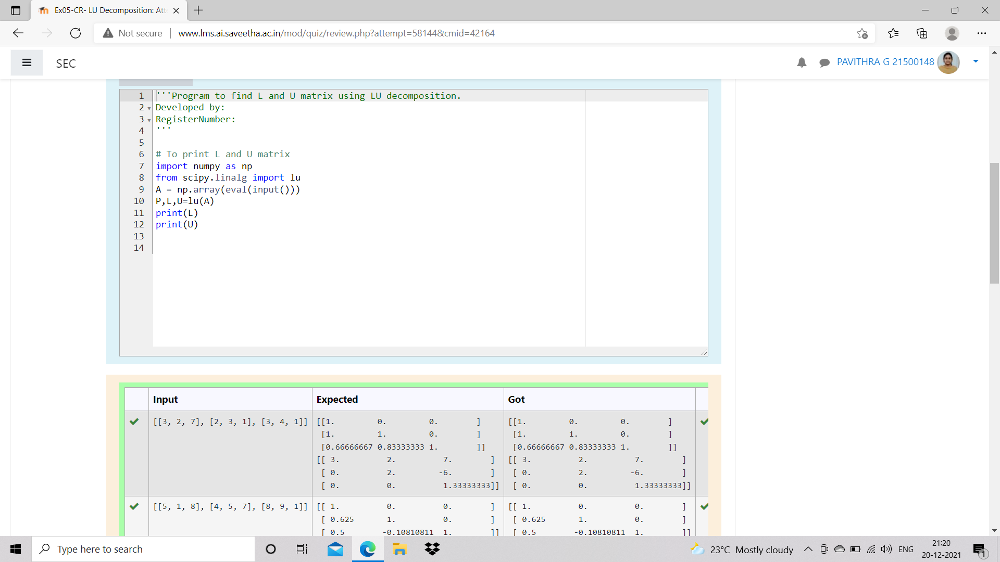
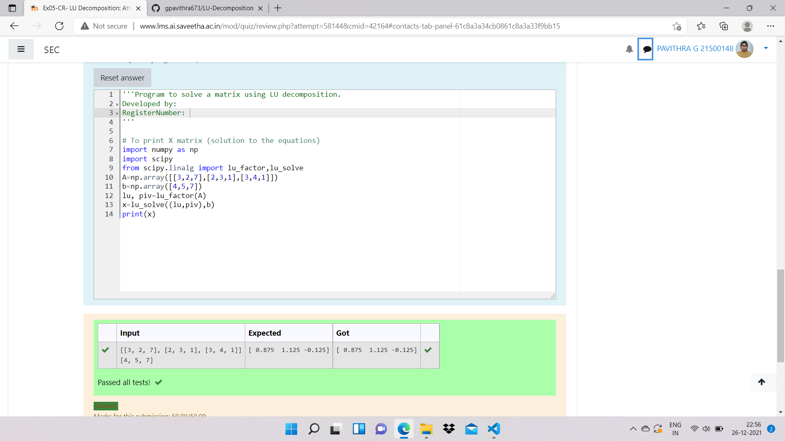

# LU Decomposition without zero on the diagonal

## AIM:
To write a program to find the LU Decomposition of a matrix.

## Equipments Required:
1. Hardware – PCs
2. Anaconda – Python 3.7 Installation / Moodle-Code Runner
## Algorithm(i):
1.Import numpy
2.Use scipy>linalg import lu to find the lu matrix 
3.print l matrix
4.print u matrix

## Program:
~~~
Program to find the LU Decomposition of a matrix.
Developed by:G.Pavithra 
RegisterNumber:21500148 
import numpy as np
from scipy.linalg import lu
A = np.array(eval(input()))
P,L,U=lu(A)
print(L)
print(U)
~~~
## Output:

## Algorithm(ii):
1.Import numpy
2.Import scipy
3.Use scipy.linalg import lu_factor,lu_solve to import the functions
4.Take input of matrix and the constants
5.Use lu_factor and lu_solve to solve the matrix
6.Print the solution of the matrix
## Program:
~~~
import numpy as np
import scipy
from scipy.linalg import lu_factor,lu_solve
A=np.array([[3,2,7],[2,3,1],[3,4,1]])
b=np.array([4,5,7])
lu, piv=lu_factor(A)
x=lu_solve((lu,piv),b)
print(x)
~~~
## Output:

## Result:
Thus the program to find the LU Decomposition of a matrix is written and verified using python programming.

